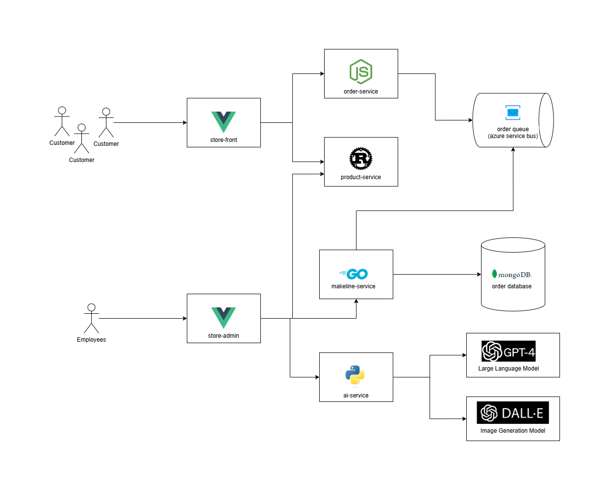

# Lab Project Assignment #2: Building a Cloud-Native App for Best Buy
Donna Ha - 041174159 </br></br>
Note: Azure Service Bus was created and connected but the attempt but not successful, so I switched back to RabbitMQ for a working application. I did however complete the bonus task.

## Updated Application Architecture


## Application and Architecture Explanation

## Deployment Instructions (Azure)
Prerequisite: Install kubectl, az login (to use azure)

How to deploy the application in a Kubernetes cluster:

### Step 1: Clone the repository
  1. Fork and clone this repository. It includes all the necessary deployment files for this application


### Step 2: Set up the AKS Cluster
  1. Log in to your Azure Portal
  2. Create a resource group in your target region, give it a name
  3. In the portal, search for **Kubernetes services** and click **Create**
  4. Choose your desired configurations
     - Choose the resource group created in the previous step
     - If you want a basic set up, follow the instructions in [Lab 6](https://github.com/ramymohamed10/Lab6_24F_CST8915) offered by Professor Ramy
  5. Use Azure CLI to log into VScode terminal (or alternative)
      - In your newly created Kubernetes service, click on connect > Azure CLI > copy and paste command
      ```
      az aks get-credentials --resource-group <Resource_Group_Name> --name <ckuster_name>
      ```

### Step 3: Set up the AI Backing Services
  1. Create an Azure OpenAI Service Instance
     - Open Azure Portal
     - Search for Azure OpenAI and click create
     - Choose the region of your choice (East US is recommended for capacity in my case) for GPT-4 and DALL-E
     - Choose resource group and pricing tier
     - Review + Create
  2. Deploy GPT-4 and DALL-E
     - Go to the created Azure OpenAI resource
     - Go to Model Deployments and click Add Deployment
     - Choose GPT-4 model and deploy it with the wanted configurations
     - Repeat for Dall-e, ensure that they are under the same region for easy use of endpoint
     - Once deployed, go to home, view JSON, and copy the key and the endpoint (the endpoint should be the same for both models as they are under the same region)
     - Encode the key by doing the following in the terminal (after you have logged in with Azure CLI)
       ```
       echo -n "<your-api-key>" | base64
       ```

  3. In the forked and cloned repository, go to the Deployments folder open secrets.yaml
     - Replace the **OPENAI_API_KEY** placeholder with the Base64-encoded value of the **API_KEY**  
  4. Go the **aps-all-in-one.yaml** file
     - Replace the placeholders with the configurations you retrieved:
     - `AZURE_OPENAI_DEPLOYMENT_NAME`: Enter the deployment name for GPT-4.
     - `AZURE_OPENAI_ENDPOINT`: Enter the endpoint URL for the GPT-4 deployment.
     - `AZURE_OPENAI_DALLE_ENDPOINT`: Enter the endpoint URL for the DALL-E 3 deployment.
     - `AZURE_OPENAI_DALLE_DEPLOYMENT_NAME`: Enter the deployment name for DALL-E 3.

   Example configuration in the YAML file:
   ```yaml
   - name: AZURE_OPENAI_API_VERSION
     value: "2024-07-01-preview"
   - name: AZURE_OPENAI_DEPLOYMENT_NAME
     value: "gpt-4-deployment"
   - name: AZURE_OPENAI_ENDPOINT
     value: "https://<your-openai-resource-name>.openai.azure.com/"
   - name: AZURE_OPENAI_DALLE_ENDPOINT
     value: "https://<your-openai-resource-name>.openai.azure.com/"
   - name: AZURE_OPENAI_DALLE_DEPLOYMENT_NAME
     value: "dalle-3-deployment"
   ```
      
### Step 4: Deploy the ConfigMaps and Secrets
- Deploy the ConfigMap for RabbitMQ Plugins:
   ```bash
   kubectl apply -f config-maps.yaml
   ```
- Create and Deploy the Secret for OpenAI API:  
   ```bash
   kubectl apply -f secrets.yaml
   ```
- Verify:
   ```bash
   kubectl get configmaps
   kubectl get secrets
   ```
      
### Step 5: Deploy the Application
   ```bash
   kubectl apply -f aps-all-in-one.yaml
   ```

- Check Pods and Services:
   ```bash
   kubectl get pods
   kubectl get services
   ```
- Go to the kubernetes service on Azure, Go to Workloads to check on the status of all the pods
- Once all are ready, go to the **Services and ingresses**, and click on the endpoint for store-front, and store-admin to access the application!


## Table of Microservice Repositories
| **Service**         | **Repository Link**                       |
|---------------------|-------------------------------------------|
| Store-Front         | `https://github.com/Donna-Smee/store-front-a2` |
| Store-Admin         | `https://github.com/Donna-Smee/store-admin-a2` |
| Order-Service       | `https://github.com/Donna-Smee/order-service-a2` |
| Product-Service     | `https://github.com/Donna-Smee/product-service-a2` |
| Makeline-Service    | `https://github.com/Donna-Smee/makeline-service-a2` |
| Ai-Service          | `https://github.com/Donna-Smee/ai-service-a2` |


## Table of Docker Images
| **Service**         | **Docker Image Link**                     |
|---------------------|-------------------------------------------|
| store-front-a2         | `https://hub.docker.com/r/dailydonuts/store-front-a2` |
| store-admin-a2         | `https://hub.docker.com/r/dailydonuts/store-admin-a2` |
| order-service-a2       | `https://hub.docker.com/r/dailydonuts/order-service-a2` |
| product-service-a2     | `https://hub.docker.com/r/dailydonuts/product-service-a2` |
| makeline-service-a2    | `https://hub.docker.com/r/dailydonuts/makeline-service-a2` |
| ai-service-a2          | `https://hub.docker.com/r/dailydonuts/ai-service-a2` |


## Any issues or limitations in the implementation
I did run into a lot of issues that I have learned from in this project. Here are just a few major ones:

### Issue 1: ai-service repository did not work 
**Problem**: The ai-service Docker image from the Professor worked, however, when I forked and cloned the ai-service-l8 repository, and built a Docker Image, it did not work

**Troubleshooting attempts**: First, I switched back to Professor Ramy’s image to confirm that it is my ai-service image that doesn’t work and not something else. Then, I thought that maybe there was something wrong with the python environment so I tried to create environments before building an image. However that did not work, but I did learn more about how the Dockerfile worked. I tried multiple more attempts, and then finally I asked a friend in class if their ai-service worked without any changes and they directed me to the requirements.txt file. I then used ChatGPT to ask them what would be wrong with the requirement.txt file, and it gave me an updated requirements.txt file, so that everything had a version. 

**Result**: After updating the requirements.txt file and creating an image, I tested it in Kubernetes and it worked!

### Issue 2: OpenAI on Azure - EastUS not available
**Problem**: I was not able to find both GPT-4 and DALL-E-3 both in East-US (or in US or Canada for that matter). Sometimes GPT-4 would be available in East-US or East-US 2, but DALL-E-3 was only available in Sweden. At first I was using my normal student Azure subscription, then I switched to the other subscription and found DALL-E-3 in East-US. However, that was to test ai-service from the issue #1. After I tried to find it again, it says no quota for everything but Sweden Central, and eventually GPT-4 also did not offer East-US.

**Troubleshooting attempts**: I tried to research quotas and how to get more/increase my quota. I also used ChatGPT to try to possibly change the .yaml file (all-in-one and secrets) so that it can use two different endpoints, however it was complicated and I was breaking the code. 
So finally I decided to try to make it both the same region, just not in East-US, whatever is available. 
I tried to create OpenAI in different regions to see if that would change anything. (it did, but not by much). I understood more about quotas as I tried to create and delete models. Finally, I saw GPT-4 was available in East-US again, and I checked Dall-e-2 instead, and it was also available in East-US, so I used Dall-e-2 instead.

**Result**: Was able to deploy GPT-4 and Dall-e-2 both in East-US, and Dall-e-2 works well with the application. Dall-e-3 can always be easily subbed in/replaced when it is available. 

### Issue 3: For the Bonus task, adding github secrets variables 
**Problem**: The KUBE_CONFIG_DATA was always too large. When I was doing lab9, I asked ChatGPT for help and the compressed command it gave me worked. However, when doing this project, it was too large.

**Troubleshooting attempts**: I tried different versions of compressing the Config Data, every time it was too large. I even tried to delete and make a new Kubernetes to see if that worked. I deleted the services, I tried creating the Kubernetes with fewer nodes. Nothing worked. So I went back to ChatGPT to ask why this config data was bigger than previously, and found out that I needed to check my context, clusters, and users using kube. So I did, I deleted contexts, and tried again. When that still didn’t work, I did the same for the clusters. And when that didn’t work, I deleted the users, and the config data file decreased dramatically!

**Result**: I learned how important it is to delete unused resources! I was able to add the secrets to github repositories without any compressing.

### Issue 4: Trying to replace RabbitMQ with Azure Service Bus
**Problem**: I followed and completed the steps to create the Azure Service Bus, and since I was unable to use the managed Identity option, I had to use the shared policy (SAS) option. 
Azure Service Bus was somehow not getting the orders correctly and I could not figure it out.

**Troubleshooting attempts**: I modified the all-in-one YAML file, especially in order-service environment variables, and redeployed everything. The store-front was still able to send orders. I then deleted the RabbitMQ part and tried again, the store-front still sends the orders but the store-admin does not receive it. I then received console errors. I then realized I had to also fix the makeline-service environment variables in the all-in-one YAML file. I also made a secret.yaml file just for Azure Service Bus to store the password. (And later I tried the primary connection string (SAS) for the Service Bus so I included that in the secrets-servicebus.yaml as well). 
I started looking at the order-service and makeline-service code to make some sense as to what is happening and what is the issue. I tried to add some print lines but was confused about where it was showing up. 
I also went on Azure Service Bus explorer to check metrics and peak at the messages.

**Result**: After a long time of poking around and making changes, I was still not able to make it work so I reverted it back to RabbitMQ so that the application still works. 

## Deployment Files
All Kubernetes deployment YAML files are in the **Deployment Files** folder in this repository. 

## Demo Video
[Demo Video Youtube Link](https://youtu.be/ud1mwPlqJXA)
(Should be unlisted)

## ✅(COMPLETED) Bonus Task: Implement a CI/CD Pipeline for Each Microservice
Check each of the repositories of the microservices for the .github/workflows/ci_cd.yaml file.
Previous (successful) actions can be seen, and is shown in the demo video. 
(Demo video also briefly shows the secret variables)


